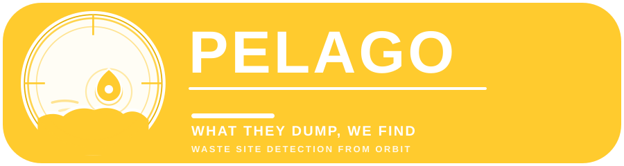
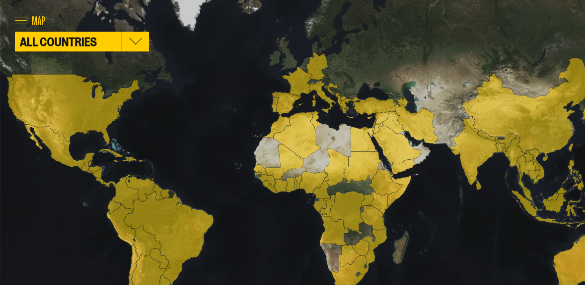
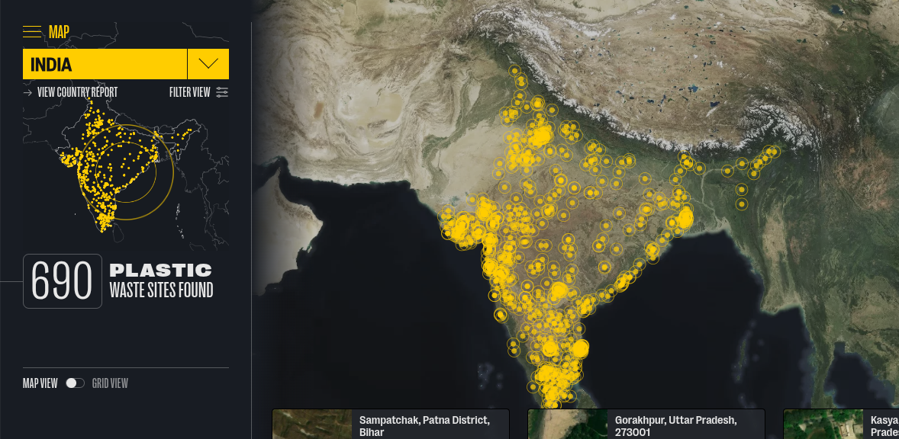
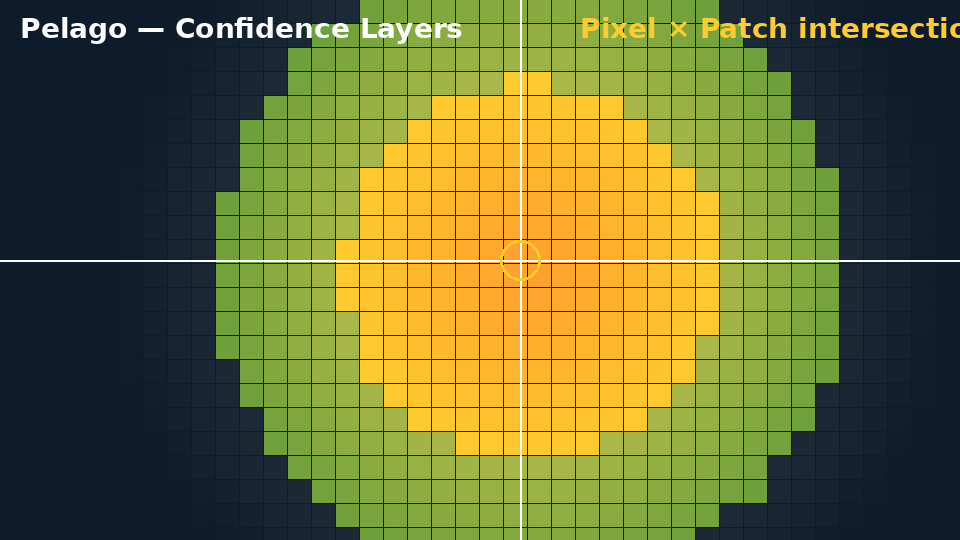
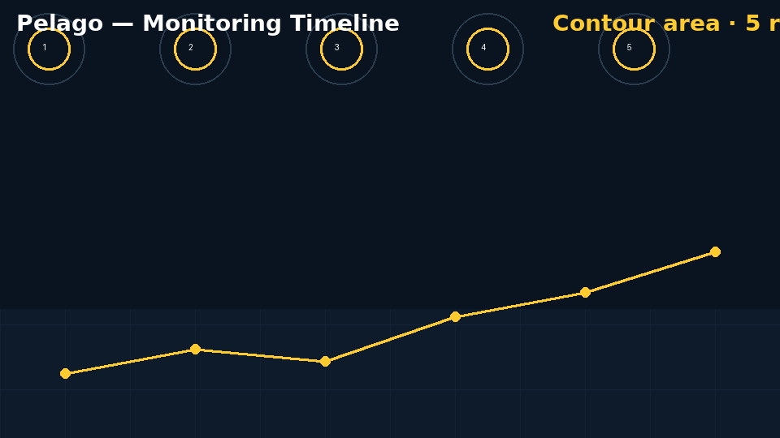
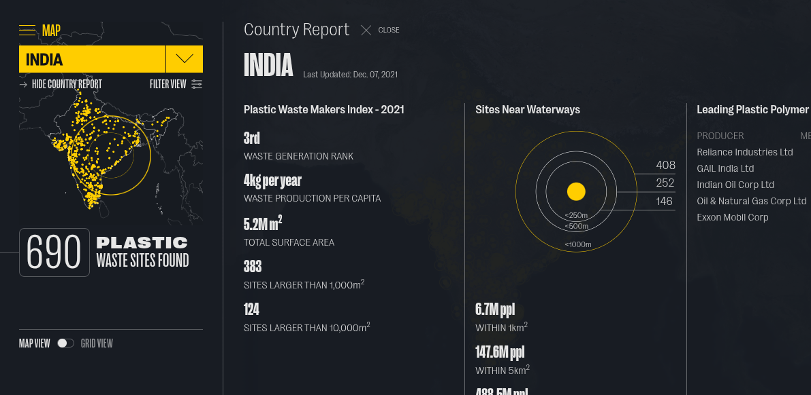

<p align="center">
  <picture>
    <source media="(prefers-color-scheme: dark)" srcset="./assets/logo.svg">
    
  </picture>
</p>

<h1 align="center">Pelago</h1>

<p align="center"><em>What they dump, we find.</em></p>

<p align="center">
  <a href="./LICENSE"></a>
  <a href="https://www.python.org/downloads/"></a>
  <a href="https://nextjs.org/"></a>
  <a href="https://github.com/Flowthread/Pelago/actions"></a>
  <a href="https://github.com/Flowthread/Pelago/pulls"></a>
  <a href="https://github.com/Flowthread/Pelago/stargazers"></a>
</p>

---

## What is Pelago? 🛰️

Pelago finds **water-adjacent dump sites** — illegal or unregulated dumping grounds near rivers, lakes, and coastlines — directly from **Sentinel-2 satellite imagery**. Using a deployable, two-stage machine-learning pipeline, Pelago screens entire regions from orbit, flags candidate sites that sit or drain toward water, and tracks them over time.

Every candidate is run through manual validation before it becomes a confirmed, monitored site. The result is a continuously updated inventory of the places where plastic and waste enter waterways — with the evidence to act on it.

## Demo & Screenshots 📸

Pelago ships a live web map with region views, site-level detail, and a monitoring timeline. Representative screens below.

| Screen | Caption |
|---|---|
|  | **Globe overview** — every validated Pelago site, plotted against population footprint and river networks. |
|  | **Site detail** — a single confirmed site with its detection footprint, contours, and Sentinel-2 context. |
|  | **Confidence layers** — pixel-classifier heatmap and patch-classifier intersections rendered as map layers. |
|  | **Monitoring timeline** — contour and spectral histories for sites under recurring observation. |
|  | **Alert feed** — new detections and expanded sites stacked into a reviewable, prioritized feed. |

If you are looking for the repository's original map exports, they live under [`docs/`](docs/) and cover Bali, Indonesia, Java, Albania, Sri Lanka, Vietnam, the Philippines, and more.

## The Problem 🌏

Plastic doesn't start in the ocean — it starts on land, next to water. 

| | |
|---|---|
| 🏞️ **Rivers are highways** | An estimated majority of ocean plastic enters through a small number of river systems. Whatever is dumped near a river gets carried downstream. |
| 🗑️ **Dumpsites are unmonitored** | Most of these sites are informal, unregulated, or simply off the map. Nobody logs them, and governments don't have an inventory. |
| 🛰️ **Satellites already see it** | Sentinel-2 revisits the entire land surface every few days at 10 m resolution. The imagery exists — it just isn't looked at systematically. |
| 📋 **Manual surveys don't scale** | Field audits and local reports are valuable but cannot cover a whole watershed, let alone a continent, at the pace of the problem. |

Pelago closes that gap by turning open satellite data into an operationally useful inventory of water-adjacent waste sites.

## The Solution 💡

Pelago finds water-adjacent plastic dump sites from **Sentinel-2 imagery using a two-stage machine-learning pipeline**.

First, a **pixel classifier** scores every pixel for the spectral signature of waste. Then a **patch classifier** — trained on weakly-labeled examples at scale — confirms whether those pixel detections form a real dump-site pattern. The **intersection of both stages** produces candidate sites, which are manually validated and then monitored over time with contour and metadata analysis.

The output is an API-backed, map-first product: worldwide detection coverage, per-site history, and a validation workflow that keeps false positives out of the confirmed inventory.

## How It Works / Architecture ⚙️

```text
┌──────────────────────────────────────────────────────────────────────────┐
│                          INGESTION                                       │
│   Sentinel-2 (10 m RGB + multispectral) → Descartes Labs catalog        │
│   Population-limited tile generation → per-region download queue        │
└──────────────────────────────────┬───────────────────────────────────────┘
                                   │
┌──────────────────────────────────▼───────────────────────────────────────┐
│                          MODEL LAYER                                     │
│   Pixel classifier (spectral waste signature, per-pixel)                │
│        │                                                                 │
│        ▼                                                                 │
│   Patch classifier (weakly-labeled ensemble over 28×28×24 windows)      │
│        │                                                                 │
│        ▼                                                                 │
│   Intersection filter (pixel ∩ patch agreement)                         │
└──────────────────────────────────┬───────────────────────────────────────┘
                                   │
┌──────────────────────────────────▼───────────────────────────────────────┐
│                          SITE DETECTION                                  │
│   Candidate generation (blob detection on scored tiles)                 │
│        │                                                                 │
│        ▼                                                                 │
│   Manual validation (imagery review by analysts)                        │
│        │                                                                 │
│        ▼                                                                 │
│   Confirmed sites (confirmed / industrial / uncertain / negative)       │
└──────────────────────────────────┬───────────────────────────────────────┘
                                   │
┌──────────────────────────────────▼───────────────────────────────────────┐
│                          METADATA + MONITORING                           │
│   Contour generation (per-site extent over time)                        │
│   Metadata enrichment (centroids, addresses via Nominatim)              │
│   Results pushed to the Pelago API                                      │
└──────────────────────────────────┬───────────────────────────────────────┘
                                   │
┌──────────────────────────────────▼───────────────────────────────────────┐
│                          PRESENTATION                                    │
│   Web map (Next.js + MapLibre)  •  Alerts  •  Monitoring dashboard       │
│   Open GeoJSON/CSV export  •  API access                                 │
└──────────────────────────────────────────────────────────────────────────┘
```

**1. Ingestion.** The pipeline pulls Sentinel-2 scenes through **Descartes Labs**, constrained to a population-weighted tile grid so compute goes where people and waste actually are.

**2. Model layer.** A **pixel classifier** scores the spectral signature of waste across each tile. A **patch classifier**, trained with weakly-labeled data and ensembled across seeds, decides whether a scored region is genuinely a dump site. Candidates require **agreement between both stages** — dramatically reducing false positives.

**3. Site detection.** Scored and filtered regions become **candidate sites**. Each candidate passes through analyst **manual validation** before being labeled a confirmed site.

**4. Metadata + monitoring.** Confirmed sites get **contours** (boundary and area over time) plus enriched **metadata** (centroid, address, catchment context). Everything is pushed to the Pelago API.

**5. Presentation.** The web application renders sites on an interactive map with confidence layers, monitoring timelines, and alert feeds — and exposes the inventory for export and programmatic access.

## Key Features ✨

- 🌍 **Global satellite coverage** — powered by open Sentinel-2 data with a population-limited detection footprint.
- 🧠 **Two-stage ML pipeline** — pixel classifier → patch classifier → intersection filter for high-precision detection.
- 🎓 **Weakly-supervised training** — patch labels mined at scale from spectral + spatial priors rather than hand-annotated imagery.
- 🎯 **Confidence-tiered detections** — confirmed, industrial, uncertain, and negative categories keep the inventory honest.
- 🔭 **Continuous monitoring** — confirmed sites are revisited and contoured over time to track expansion and new activity.
- 🗂️ **Open data export** — candidate sites, validated points, and metadata as standard GeoJSON/CSV.
- 🔌 **API access** — a loader service pushes model outputs into the Pelago API for the web app and integrations.
- 🛰️ **Sentinel-2 native** — detections are grounded in real 10 m multispectral observations, not modeled estimates.

## Tech Stack 🧰

| Layer | Technology | Purpose |
|---|---|---|
| **Satellite data** | Copernicus Sentinel-2 | 10 m multi-spectral imagery of the full land mass |
| **Cloud imagery access** | Descartes Labs | Bulk scene search, download, and scalable inference |
| **Modeling** | Python · TensorFlow · scikit-learn | Pixel classifier, patch classifier, feature pipelines |
| **Geospatial** | GeoPandas · Rasterio · Shapely · PyProj | Vector/contour processing and geometry handles |
| **MLOps / Deploy** | Descartes `Deploy` endpoints | Distributed candidate detection and contour runs |
| **Backend API** | Go · Pelago loader (`loader/`) | Ingests model outputs, serves site data |
| **Frontend** | Next.js · MapLibre · TypeScript | Interactive globe, site detail, monitoring dashboard |
| **Data formats** | GeoJSON · CSV · HDF5 | Interchange between models, validation, and API |

## Pipeline in Detail 🔬

### Model Training

| Module | Inputs | Role |
|---|---|---|
| `create_pixel_dataset` · `create_spectrogram_dataset` | Raw Sentinel-2 tiles | Assemble per-pixel training chips and temporal spectrograms |
| `train_pixel_classifier` · `train_spectrogram_classifier` | Pixel-level crops | Learn the spectral waste signature; emit a temporal pixel model |
| `train_patch_classifier` | Weak labels + pixel scores | Learn site-level structure; ensemble, SVM, and 1 px variants trained at scale |

Notebooks: [`create_pixel_dataset.ipynb`](notebooks/create_pixel_dataset.ipynb) · [`create_spectrogram_dataset.ipynb`](notebooks/create_spectrogram_dataset.ipynb) · [`train_pixel_classifier.ipynb`](notebooks/train_pixel_classifier.ipynb) · [`train_spectrogram_classifier.ipynb`](notebooks/train_spectrogram_classifier.ipynb) · [`Train Patch Classifier (Weak Labeling, Ensemble/SVM/1px/LARGE).ipynb`](notebooks/Train%20Patch%20Classifier%20Weak%20Labeling%20-%20Ensemble,%20SVM,%201px,%20LARGE.ipynb)

Trained artifacts live under [`models/`](models/), versioned by release (e.g., `v0.0.7`, `v0.0.11`, ensemble families).

### Site Detection

| Module | Role |
|---|---|
| `generate_populated_dltiles` | Compute a population-weighted tile grid for a region |
| `descartes_spectrogram_run_withpop` | Deploy pixel + patch inference over the region on Descartes |
| `descartes_candidate_detect` | Run blob detection to extract candidate sites from scored tiles |
| `query_patch_classifier` | Keep only candidates that pass the patch-classifier intersection |
| `validate_candidate_sites` | Analyst review of candidates → confirmed / industrial / uncertain / negative |

Notebooks: [`generate_populated_dltiles.ipynb`](notebooks/generate_populated_dltiles.ipynb) · [`descartes_spectrogram_run_withpop.ipynb`](notebooks/descartes_spectrogram_run_withpop.ipynb) · [`descartes_candidate_detect.ipynb`](notebooks/descartes_candidate_detect.ipynb) · [`query_patch_classifier.ipynb`](notebooks/query_patch_classifier.ipynb) · [`validate_candidate_sites.ipynb`](validation/validate_candidate_sites.ipynb)

Validated sites are stored under [`data/sampling_locations/`](data/sampling_locations/) and candidate detections under [`data/model_outputs/candidate_sites/`](data/model_outputs/candidate_sites/).

### Metadata & Monitoring

| Module | Role |
|---|---|
| `generate_metadata` | Enrich confirmed sites with centroids, addresses, and context |
| `descartes_contour_run` | Generate per-site contours on Descartes (boundary and area over time) |
| `loader` | Push enriched model outputs into the Pelago API for the web app |

Notebooks: [`generate_metadata.ipynb`](notebooks/generate_metadata.ipynb) · [`descartes_contour_run.ipynb`](notebooks/descartes_contour_run.ipynb)

Contours and metadata are served through the API rather than stored in the repository — see [`loader/README.md`](loader/README.md) for the ingestion pipeline.

## Performance & Metrics 📊

Pelago's pipeline has been exercised across South and Southeast Asia, the Mediterranean, Africa, and South America. Numbers below reflect the current operating inventory:

| Metric | Value |
|---|---|
| Confirmed positive sites | 4,700+ validated across operating regions |
| Labeled validation dataset | 19,900+ features (positive / negative / industrial / uncertain) |
| Largest tracked sites | Top 100 largest sites by area, maintained in-site inventory |
| Regional exports | 38+ interactive maps under `docs/` |
| Spatial resolution | 10 m (Sentinel-2) |
| Detection footprint | Population-weighted global tile grid |
| Validation workflow | Analyst-reviewed, confidence-tiered |
| Refresh cadence | Recurring on each Sentinel-2 revisit cycle |

The paper describes the approach in detail and includes quantitative validation of the pixel and patch classifiers.

## Getting Started 🚀

### 1. Clone & install

```bash
git clone https://github.com/Flowthread/Pelago.git
cd Pelago
python -m venv env
source env/bin/activate
pip install -r requirements.txt
```

Python ≥ 3.7 is supported.

### 2. Configure data access

Imports are relative to the repository root, which must be on `PYTHONPATH`:

```bash
export PYTHONPATH=/path/to/pelago:$PYTHONPATH
```

The bulk-processing pipeline runs on Descartes Labs:

```bash
descarteslabs auth login
```

Follow the link to enter your email and password. If needed, see the [Descartes authentication docs](https://docs.descarteslabs.com/authentication.html).

### 3. Run the pipeline

```bash
# Train or use a released model (models/)
python -m scripts.deploy_nn_v0            # deploy pixel inference
python -m scripts.candidate_detect        # generate candidate sites
python -m scripts.deploy_query_patch      # run patch-classifier intersection
python -m scripts.contour_gen             # generate contours for confirmed sites

# Push validated sites to the API
cd loader && python load.py
```

Each stage is also available as a runnable pipeline notebook under [`notebooks/`](notebooks/) and produces standard GeoJSON/CSV outputs under [`data/`](data/).

## Project Structure 📁

```text
Pelago/
├── api/                      # Backend API (Go)
├── assets/                   # Brand assets, logo, pipeline diagrams
├── data/
│   ├── boundaries/           # Region boundary files
│   ├── model_outputs/        # Candidate sites, contours, patch results
│   ├── sampling_locations/   # Validated site inventories (GeoJSON)
│   └── site_metadata/        # Site-level metadata & largest-sites export
├── docs/
│   ├── screenshots/          # Product screens for the README gallery
│   └── *.html                # Regional map exports
├── frontend/                 # Next.js + MapLibre web application
├── loader/                   # Model-output → API loader (Go + Python)
├── models/                   # Versioned model artifacts
├── notebooks/                # Runnables for each pipeline stage
├── paper/plos/               # Manuscript source (LaTeX/PDF)
├── scripts/                  # Core Python modules (dl_utils, nn_predict, ...)
├── validation/               # Candidate validation tooling
├── .github/workflows/        # CI (lint, build, test on ./api)
├── requirements.txt
└── README.md
```

## Roadmap 🗺️

- [x] Two-stage pixel → patch detection pipeline
- [x] Operational candidate generation on Descartes Labs
- [x] Analyst validation workflow and confidence-tiered inventory
- [x] Contour generation and site-level monitoring
- [x] API ingestion loader and open GeoJSON/CSV export
- [x] Region expansions: South & Southeast Asia, Mediterranean, Africa, South America
- [ ] Expanding detection to new river basins and coastal watersheds
- [ ] Adding higher-cadence revisit monitoring for high-risk sites
- [ ] Integrating additional Sentinel-2 band products for finer material discrimination
- [ ] Publishing a public API endpoint for alert subscriptions

## License ⚖️

The Pelago software is released under the **MIT License** (see [`LICENSE`](LICENSE)).

## Project Timeline

- **Aug–Sep 2026** — Built for NextStep Hacks 2026 (Earth Forward)
- **Submission** — September 2026

## Author

**Flowthread** — [GitHub](https://github.com/nahhitsreal)
Built for NextStep Hacks 2026.

---

<p align="center"><sub>Built for NextStep Hacks 2026 — Earth Forward 🌱</sub></p>
